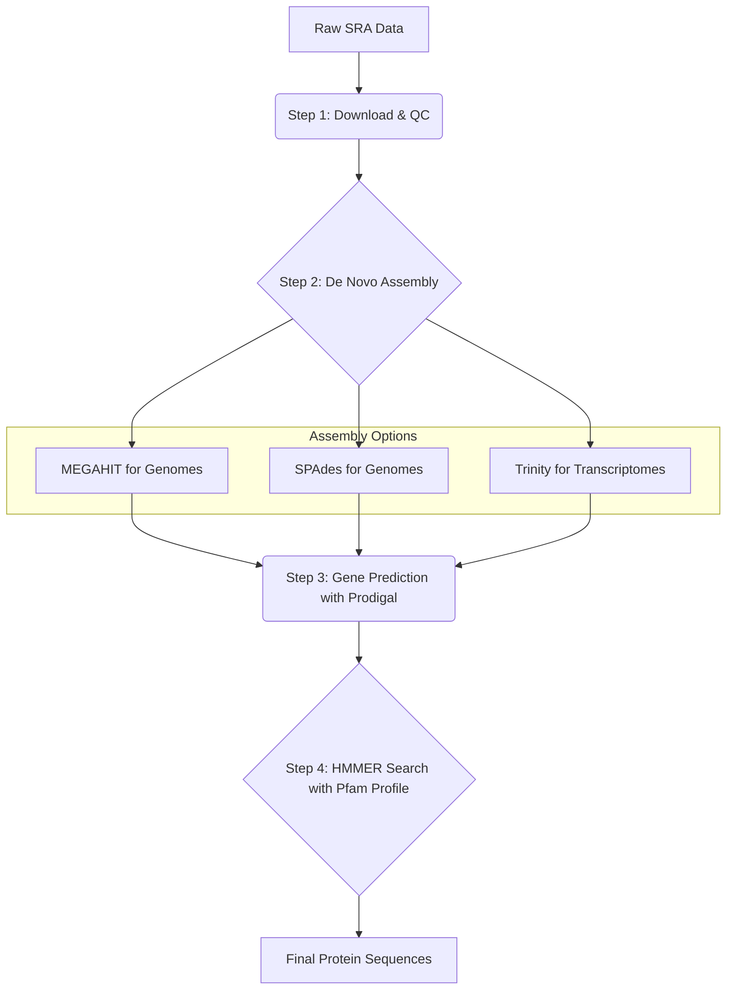

-----

# Marauder's GenoMap 🗺️

A comprehensive pipeline for the discovery of protein domains and families in *de novo* assembled genomes and transcriptomes.

-----

`Marauder's GenoMap` is a bioinformatics pipeline designed to prospect for and identify specific protein domains and families in genomes or transcriptomes, particularly for non-model organisms for which no reference genome is available. It can also be used to perform comparative genomics and to search for unidentified potential biotechnological targets.

The pipeline automates the entire discovery process, from raw sequencing data to a final list of protein sequences. It begins by retrieving data from the [SRA](https://www.ncbi.nlm.nih.gov/sra), performs quality control and *de novo* assembly, predicts protein-coding genes, and finally uses [HMMER](http://hmmer.org/) and [Pfam](http://pfam.xfam.org/) profiles to perform a sensitive protein family search. This approach allows identification of retained protein function, even with low sequence identity.

This pipeline is optimized for gene discovery and annotation. It does not focus on differential gene expression or other quantitative analyses.

## Features

  * **Automated Data Retrieval**: Downloads raw sequencing data directly from the SRA using SRA-Toolkit.
  * **Robust QC**: Integrates [**FastQC**](https://www.bioinformatics.babraham.ac.uk/projects/fastqc/) and [**MultiQC**](https://seqera.io/multiqc/) for comprehensive quality control reporting before and after trimming.
  * **Flexible Assembly Options**: Supports multiple state-of-the-art assemblers for different data types and hardware constraints:
      * [**MEGAHIT**](https://github.com/voutcn/megahit): A memory-efficient and fast assembler, ideal for single genomes on standard hardware.
      * [**SPAdes**](https://github.com/ablab/spades): A highly accurate assembler, recommended for systems with significant RAM (\>64 GB).
      * [**Trinity**](https://github.com/trinityrnaseq/trinityrnaseq/wiki): The gold standard for *de novo* transcriptome (RNA-Seq) assembly.
  * **Read Normalization**: Includes an optional digital normalization step with [**BBnorm**](https://archive.jgi.doe.gov/data-and-tools/software-tools/bbtools/bb-tools-user-guide/bbnorm-guide/) to reduce dataset complexity and lower memory requirements for assembly.
  * **Accurate Gene Prediction**: Uses [**Prodigal**](https://github.com/hyattpd/Prodigal) to identify protein-coding genes within the assembled contigs/scaffolds.
  * **Sensitive Protein Search**: Employs **HMMER** for sensitive homology searches, allowing for the discovery of both close and distant family members.
  * **Automated Sequence Extraction**: Includes a final step to automatically parse search HMMER results and extract the identified protein sequences into a clean FASTA file using **seqtk**.

## Pipeline Overview

The pipeline follows a logical flow from raw data to final results. The user can choose the appropriate assembly path based on their data type (genomic or transcriptomic) and available computational resources.



## Prerequisites

To run this pipeline, you will need the following bioinformatics tools installed. On a Debian/Ubuntu-based system, most can be installed with `apt`.

  * SRA Toolkit
  * FastQC & MultiQC
  * Trimmomatic
  * BBTools
  * SPAdes
  * MEGAHIT
  * Trinity
  * Prodigal
  * HMMER
  * seqtk

**Installation Example (Ubuntu/Debian):**
You can execute the [`setup.sh`](setup.sh) file to install all the above tools.

## Usage

The pipeline is run as a series of scripts.

### Part 1: Retrieving the data (`SRAget.sh`)

The script [`SRAget.sh`](SRAget.sh) download and proccess the NGS sequecing files. 

```bash
./get.sh <SRA_accession>
```
### Part 2: Assembly (`assembly*.sh`)

This script handles data download, QC, trimming, normalization, and assembly. Choose the correct script to execute.
- [assembly-spades.sh](assembly-spades.sh).
- [assembly-megahit.sh](assembly-megahit.sh).
- [assembly-trinity.sh](assembly-trinity.sh) - NEW.

#### Choosing the Assembly Script:

Choosing the appropriate tool depends on your research goals, available hardware/computer resources, and personal preference (see the summary table below). If your system has less than 64 GB of RAM, we recommend starting with MEGAHIT.

SPAdes and Trinity are significantly more memory-intensive. While the scripts provided below include options to cap RAM usage for these programs, please note that such limitations may render the assembly unfeasible depending on the size and complexity of your dataset—either due to excessive processing times or reaching computational limits.

Read normalization via **BBnorm** is only performed for MEGAHIT and SPAdes. In contrast, Trinity features an integrated in silico normalization utility, which it runs by default to minimize memory overhead.

| Script | Data Type | Recommended RAM | Notes |
| :--- | :--- | :--- | :--- |
| [assembly-spades.sh](assembly-spades.sh) | Genomic | \>64 GB | High accuracy |
| [assembly-megahit.sh](assembly-megahit.sh) | Genomic | \<8 GB | Fast and memory-efficient |
| [assembly-trinity.sh](assembly-trinity.sh) | Transcriptomic | \<8 GB | Gold standard for RNA-Seq |

#### Configure the script:
Ensure the paths and parameters inside the script (e.g., adapter file location) are correct for your system.
#### Execute:

```bash
./assembly_megahit.sh SRR_ACCESSION_1.fastq.gz SRR_ACCESSION_2.fastq.gz
```
    
This will produce an output directory (e.g., `05_MEGAHIT_Assembly_...`) containing your final assembly file, `final.contigs.fa`.

### Part 2: Protein Search (`ProtSearch.sh`)

This script predicts genes and searches for your protein family.

#### Download an HMM Profile: 
Obtain a profile for your family of interest from the [Pfam database](https://www.ebi.ac.uk/interpro/entry/pfam/).
#### Execute:

```bash
./ProtSearch.sh 05_MEGAHIT_Assembly/final.contigs.fa Your_Family.hmm
```
This generates a directory (`02_HMMER_Results`) containing a table of significant hits.

### Part 3: Sequence Extraction (`get_Seq_results.sh`)

This final script retrieves the full sequences of the proteins you found.

#### Execute:

```bash
./get_Seq_results.sh 02_HMMER_Results/Your_Family_hits.tbl 01_Predicted_Proteins/predicted_proteins.faa
```

The final output is a clean FASTA file (e.g., `protein_hits.faa`) containing only the protein sequences of interest, ready for further analysis.

-----
